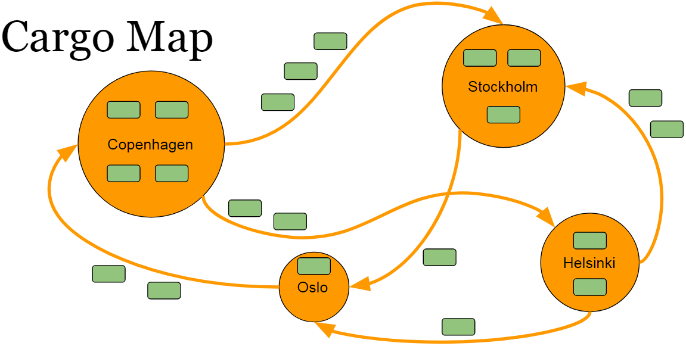

# Global Snapshot Akka

## Status

**`DONE`**: Cargo map setup with message passing

**`CHECK`**: Akka message delivery guarantee and acknowledgement

**`TODO`**: Add tests

**`TODO`**: Chandy-Lamport algorithm (marker message)

## Introduction

The Cargo company operates by moving the cargo between the stations.
The cargo represents a movable entity.
The station represents a permanent storage where cargo remains for some time until transferred to another station.
The transfer only happens between two different stations.
The stations and transitions form an acyclic directed graph with no parallel edges and referred to as a cargo map.

The cargo map consists of 4 stations and 6 transitions.
The stations are the Nordic capitals: Helsinki (H), Stockholm (S), Oslo (O) and Copenhagen (C).
The transitions are unidirectional (->) paths from station to station: H -> O, H -> S, S -> O, O -> C, C -> S, C -> H.
The Cargo map is outlined on the picture below.
The orange circles with name tags represent the stations.
The orange arrows represent the directed connection between the stations.
The green rectangles represent the cargo.



The number of cargo on the picture is an example and may be different depending on the project setup.

The problem is to make sure that no cargo is lost at any point in time without interruption of the regular operations.
The problem can be solved by taking a global snapshot of the cargo map to reveal the total number of cargo.
The project goal is to track the number of cargo in both stations and transition using the [Chandy-Lamport algorithm](https://en.wikipedia.org/wiki/Chandy-Lamport_algorithm). The project is implemented using Scala and Akka Actors.

## Setup

All of the configurations happen in [application.conf](src/main/resources/application.conf).
Initially no cargo is present in transit.
The initial number of cargo present in stations can be configured under the `cargo.initial.count`.
The stations start cargo transfer operations as soon as the application starts.
The number of cargo available for transfer is configured under the ```cargo.unload``` option where ```cargo.unload.min``` determines the minimum amount of cargo to unload while ```cargo.unload.max``` determines the maximum amount of cargo to unload. 

## Run

Start the application:

> **`sbt run`**

The stations are being set up and the cargo starts flowing between the stations as defined by the cargo map.

Hit enter to silence the logs and enter the CLI.

Type ```log``` to brings the logs back to the screen.

For the purpose of flexibility there is an additional functionality included.
It is possible to introduce a new station into the existing cargo map.
The new station is called Berlin (B) and it is interconnected with every other station in both directions.
The station can join the cargo map using the ```join``` command.
The station can leave the cargo map using the ```leave``` command. 

Type ```marker``` to initiate the global snapshot.

Type ```exit``` to terminates the application.

## Requirements

* Scala 2.12.3
* sbt 0.13.15
* [akka](http://akka.io)
* [scalatest](http://www.scalatest.org)
